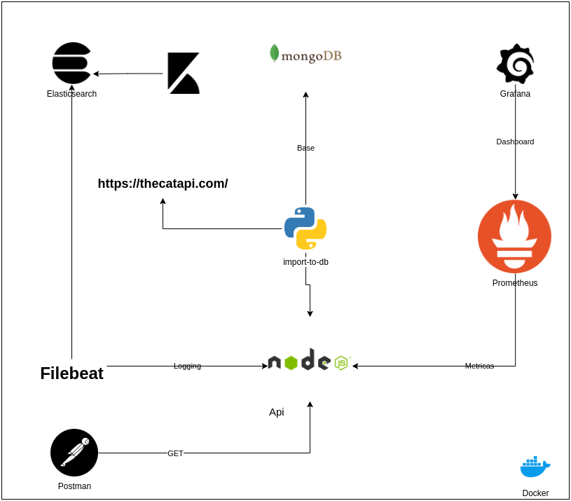

### INTRO

Case https://thecatapi.com/ , todos os servicos em containers, cobertura de metricas e logging em todos endpoints
Autor: Vitor Perin

## PRE REQUISITOS

- Docker version 20.10.7, build f0df350
- Docker-compose version 1.29.2, build 5becea4c

## STACK UTILIZADA

- api - javascript
- import-to-db python 
- MongoDb
- ElasticSearch
- Prometheus
- Grafana
- Kibana

## COMO INICIAR

a partir da pasta inicial do projeto execute: 

>  docker-compose run import-to-db && docker-compose up

Vai iniciar:
- extração da api para o mongodb ( duração estimada 1min )
- api e servicos de metrica,logging
- grafana e kibana para visualização dos dashboard e logging

no postman, importe o arquivo api.postman_collection.json com todas as api
### Endpoints para acesso

- Api localhost:8080 
- Grafana localhost:3000
- Prometheus localhost:9090
- Kibana localhost:5601
- Mongo-express localhost:8081 ( especifico para docker-compose.import_db.yml )

## Projeto

### api
    Expoem api's, metricas e logging 
    /src/
        /cats.js conjuntos de api
        /index.js expoem o servico e helpers
        /logger.js helper para o servico de logging
        /metrics.js helper para geração de metricas
        /mongo.js helper para conexao com o banco

    Dockerfile cria em 2 estagios a imagem e suas dependencias, utiliza nodemon para autoreload  
### import-to-db
    Servico para extração dos dados da api https://thecatapi.com/ para o mongodb, iniciado apenas 1 vez
    Dockerfile cria em 1 estagio a imagem e suas dependencias
    main.py inicia a extração da thecatapi.com e salva todas as informações na base de dados para uso posterior

    dados no banco:
    -  todas as raças de gatos disponíveis com 3 images se disponivel
    -  3 imagens de gatos com chapéu
    -  3 imagens de gatos com  3 imagens de gatos com chapéu
## API

Documentação da api pelo postman em api.postman_collection.json

### Configurações de servico
    kibana.yml
    prometheus.yml
    filebeat.docker.yml
#### Docker
    docker-compose.yml inicia todos os servicos de metricas,logging e api 
    docker-compose.import_db.yml inicia o servico de extração junto com o mongodb

##  Base de dados

## 3 Dashboards com latencia, errors e quantidade de execução ( requests )

## logging 

